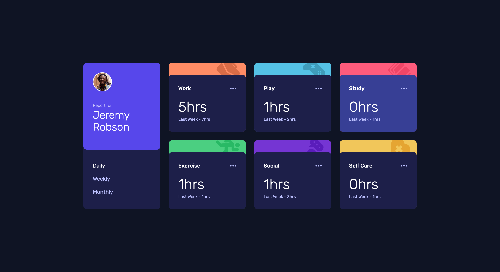

# Frontend Mentor - Time tracking dashboard solution

This is a solution to the [Time tracking dashboard challenge on Frontend Mentor](https://www.frontendmentor.io/challenges/time-tracking-dashboard-UIQ7167Jw). Frontend Mentor challenges help you improve your coding skills by building realistic projects.

### The challenge

Users should be able to:

- View the optimal layout for the site depending on their device's screen size
- See hover states for all interactive elements on the page
- Switch between viewing Daily, Weekly, and Monthly stats

### Screenshot

### Links

- Live Site URL: [https://stetu281.github.io/frontendmentor-dashboard](https://stetu281.github.io/frontendmentor-dashboard)

### Built with

- React
- Tailwind
- Css Grid

## Author

- Website - [Stefan](https://www.stefanturner.ch)
- Frontend Mentor - [@stetu281](https://www.frontendmentor.io/profile/stetu281)
